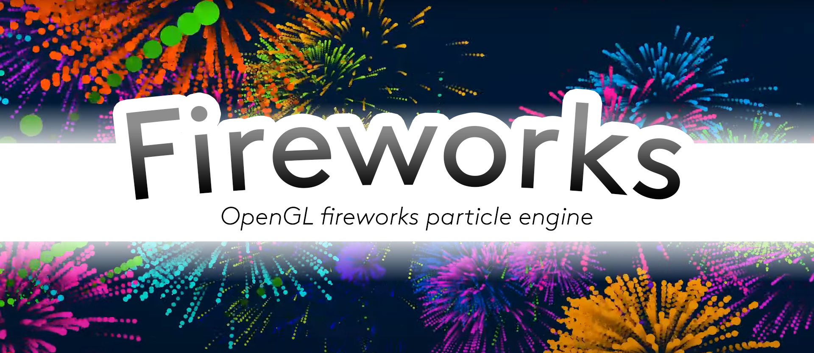

    

  
  

This project is a particle renderer engine made with OpenGL. I made use of instanciation and billboards for rendering batches of quads each one of them holding specific velocity, lifetime and color.

## Video demo
Check the YouTube video demo right [here](https://www.youtube.com/watch?v=0-K-u8UzkvA).

## Libraries
- glfw3 (windowing, inputs)
- glm (OpenGL mathetmatics)
- glad (OpenGL loading library)
- irrKlang (sounds)
